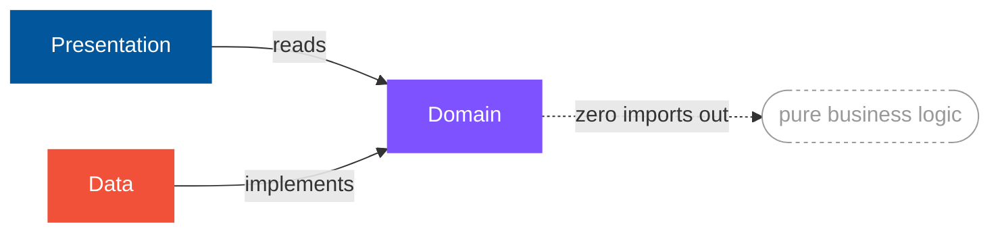

## 💳 Currently

Mobile Software Engineer based in Tunis, building a production fintech wallet at **Maarpay** — GCC and MENA markets, real money, real users, no room for "close enough."

I work across native Android, native iOS, and Flutter, and pick whichever one the problem actually needs — not whichever one is trendy.

## 🏗️ How I Build

*Domain imports nothing — no framework, no packages. Everything else depends inward.*

- 🧪 Tests aren't optional. If it isn't verified, it isn't done.
- 🔐 Security is default-on — no secrets in code, no PII in logs, ever.
- ✂️ The smallest diff that fixes the root cause wins. No hero PRs, no drive-by rewrites.
- 🧭 Match the codebase you're in before introducing a new pattern to it.
- 📱 Verify on a real device, not just green CI.

## 🧩 Where I Operate

| Discipline | What it covers |
|---|---|
| 🦋 **Flutter Engineering** | Dart · scalable state management · platform channels · isolates and performance profiling |
| 🤖 **Android (native)** | Kotlin · Jetpack Compose · Coroutines and Flow · dependency injection |
| 🍎 **iOS (native)** | Swift · SwiftUI · Combine · Keychain and biometrics |
| 🏛️ **Architecture** | Clean Architecture · modularization · domain-driven boundaries |
| ✅ **Quality** | Unit and widget testing · static analysis gates · code review discipline |
| 🛡️ **Mobile Security** | Secure local storage · certificate pinning · root/jailbreak detection · hardened release builds |
| 🚀 **Release Engineering** | CI/CD pipelines · staged rollouts · crash monitoring · store compliance |

## 📊 Activity

  

<picture>
  <source media="(prefers-color-scheme: dark)" srcset="https://streak-stats.demolab.com/?user=saifmessaoudi&hide_border=true&background=00000000&ring=A78BFA&fire=FF8A65&currStreakLabel=A78BFA&sideLabels=E7E9F5&currStreakNum=E7E9F5&sideNums=E7E9F5&dates=8b8ba0" />
  
</picture>

## 📫 Connect

